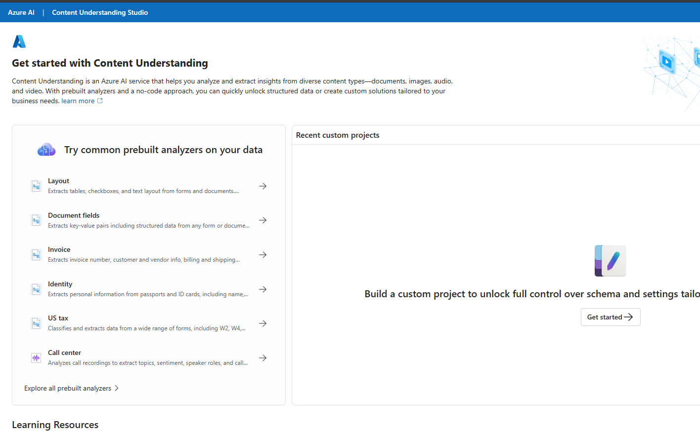
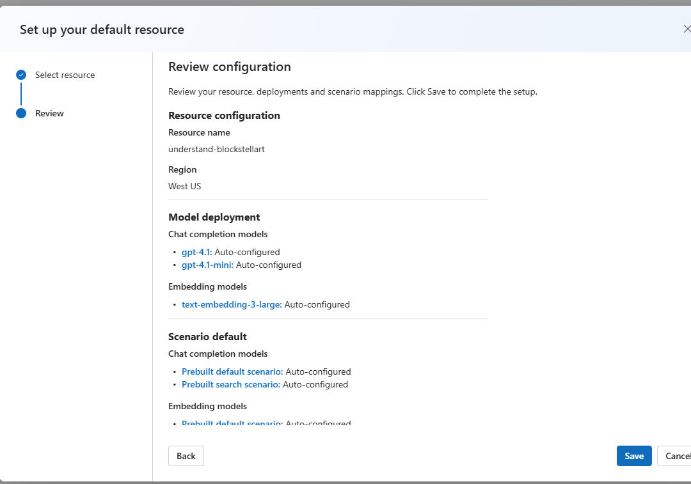
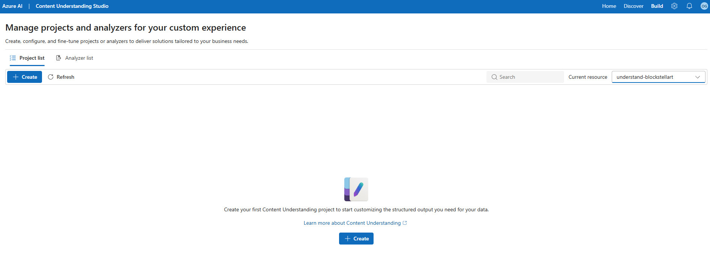
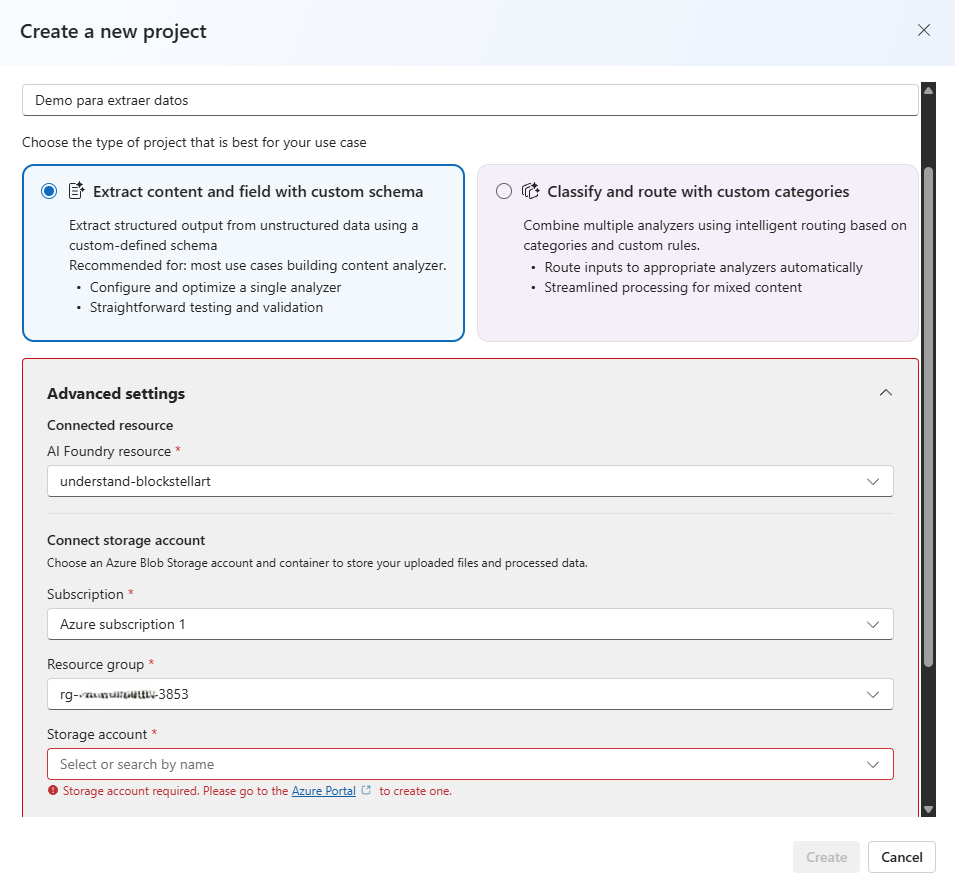
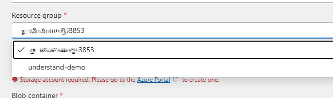
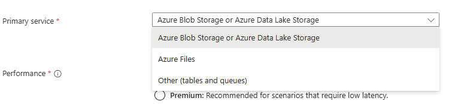
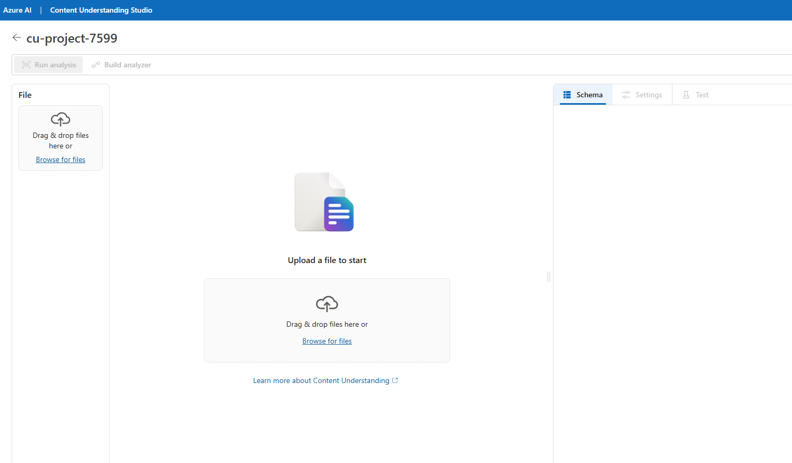
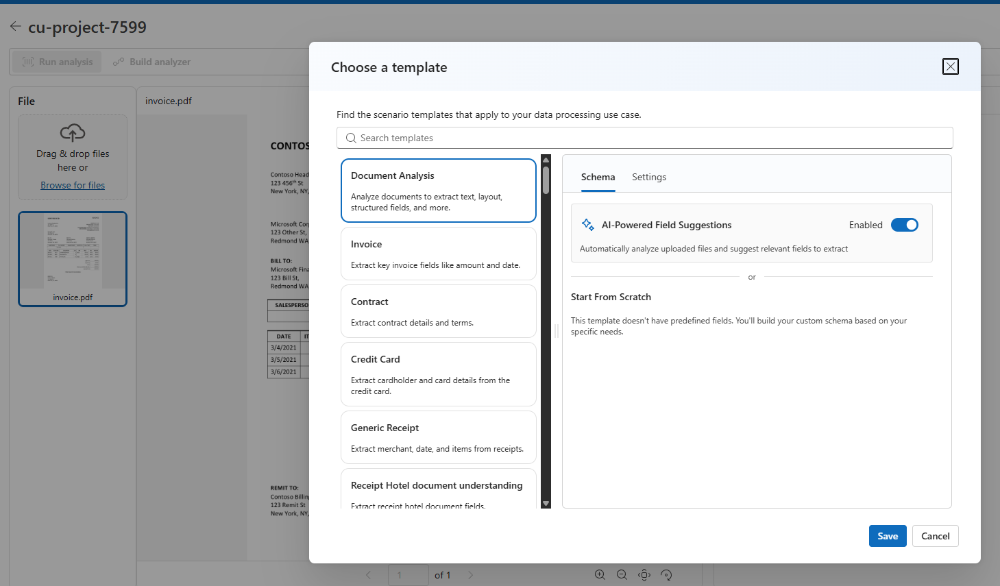

# [DEMO] Extraccion de informacion con Azure Content Understanding

App local sencilla para que estudiantes suban un documento o formulario y vean los datos extraidos en una tabla.

## Ejecuta en Windows

Haz doble clic en:

```text
iniciar_app.bat
```

Ese archivo prepara todo y abre la app en:

```text
http://localhost:8501
```

Cuando termine de cargar, sube un archivo desde `documentos-ejemplo/`.

## Ejecuta en Mac o Linux

Abre una terminal en esta carpeta y ejecuta:

```bash
chmod +x iniciar_app.sh
./iniciar_app.sh
```

Despues abre:

```text
http://localhost:8501
```

## Que hace la app

La app extrae informacion de varios tipos de archivo usando Azure Content Understanding:

- **Documentos e imagenes:** texto mediante **OCR Read** (`prebuilt-read`).
- **Audio:** transcripcion y resumen (`prebuilt-audioSearch`).
- **Video:** transcripcion y segmentacion por escenas (`prebuilt-videoSearch`).

La modalidad se detecta automaticamente segun el archivo que subas.

La app tiene dos modos:

- **Modo demo:** funciona sin Azure y usa datos simulados para explicar el flujo.
- **Modo Azure:** llama a Azure Content Understanding cuando configuras tus credenciales.

Para una clase introductoria, usa primero el **Modo demo**.

## Requisitos

- Python 3.10 o superior
- Opcional: recurso de Azure AI Foundry con Content Understanding configurado

## Si prefieres ejecutarlo por terminal

En Windows:

```powershell
.\iniciar_app.bat
```

En Mac o Linux:

```bash
./iniciar_app.sh
```

## Usar modo demo

No necesitas configurar nada. Si faltan credenciales de Azure, la app muestra resultados simulados.

Este modo es ideal para explicar:

1. Que el usuario sube un documento.
2. Que una herramienta de IA lo analiza.
3. Que el resultado se convierte en datos estructurados.
4. Que esos datos se pueden descargar como CSV.

## Usar modo Azure

### Crear el recurso en Azure

1. Entra a [Azure Portal](https://portal.azure.com).
2. Busca Azure AI Foundry o Foundry resource.
3. Crea un recurso nuevo.
4. Elige una región soportada para Content Understanding.
5. Cuando termine, abre el recurso.
6. Ve a Resource Management > Keys and Endpoint.
7. Copia:
    * Endpoint
    * Key 1

Microsoft indica que el endpoint suele verse así:
https://<tu-recurso>.services.ai.azure.com/

Antes de conectar la app local, necesitas preparar Content Understanding y crear un analyzer.

### Preparar Content Understanding

1. Entra a [Azure AI Foundry](https://ai.azure.com) y abre **Content Understanding Studio**.



2. En la parte derecha, en **Recent custom projects**, haz clic en **Get started**.

3. Si aparece la pantalla **Set up your default resource**, revisa que el recurso sea el correcto y haz clic en **Save**.



En esta pantalla Azure configura modelos necesarios para Content Understanding. Puede tardar unos minutos.

4. Cuando termine, llegaras a **Manage projects and analyzers for your custom experience**.



### Crear el analyzer

1. En **Project list**, haz clic en **+ Create**.

2. Escribe un nombre sencillo para el proyecto, por ejemplo:

```text
Demo para extraer datos
```

3. Selecciona:

```text
Extract content and field with custom schema
```



4. En **Advanced settings**, confirma el recurso de Azure AI Foundry.

5. En **Resource group**, selecciona el mismo grupo donde esta tu recurso de Foundry.




6. En **Storage account**, selecciona un Storage Account existente.

Si no tienes uno, crea uno en Azure Portal con valores simples:

```text
Primary service: Azure Blob Storage or Azure Data Lake Storage
Performance: Standard
Redundancy: Locally-redundant storage (LRS)
```



7. Si te pide **Blob container**, puedes crear o seleccionar un contenedor para los archivos del proyecto.

Un nombre sencillo:

```text
content-understanding-demo
```

8. Haz clic en **Create**.

9. Dentro del proyecto, sube un documento con **Browse for files**.



10. Cuando aparezca **Choose a template**, selecciona una plantilla segun el documento:

- Para facturas: **Invoice**
- Para documentos generales o formularios: **Document Analysis**

Para la demo con `invoice.pdf`, selecciona:

```text
Invoice
```

Deja activado:

```text
AI-Powered Field Suggestions
```

y haz clic en **Save**.



11. Revisa el panel **Schema**. Azure sugerira campos para extraer.

12. Haz clic en **Run analysis** para probar la extraccion.

13. Si los resultados se ven bien, haz clic en **Build analyzer**.

14. Cuando termine, abre la pestana **Analyzer list** y copia el **Analyzer ID**.

Ese valor es el que vas a pegar en:

```text
AZURE_CONTENT_UNDERSTANDING_ANALYZER_ID=
```

### Conectar la app local con Azure

1. Copia `.env.example` como `.env`.
2. Llena los valores:

```text
AZURE_CONTENT_UNDERSTANDING_ENDPOINT=
AZURE_CONTENT_UNDERSTANDING_KEY=
AZURE_CONTENT_UNDERSTANDING_ANALYZER_ID=
AZURE_CONTENT_UNDERSTANDING_API_VERSION=2025-11-01
```

Ejemplo:

```text
AZURE_CONTENT_UNDERSTANDING_ENDPOINT=https://tu-recurso.services.ai.azure.com
AZURE_CONTENT_UNDERSTANDING_KEY=tu-key-1
AZURE_CONTENT_UNDERSTANDING_ANALYZER_ID=el-analyzer-id-que-copiaste
AZURE_CONTENT_UNDERSTANDING_API_VERSION=2025-11-01
```

3. Reinicia la app local.
4. Con las credenciales en el `.env`, la app usa Azure automaticamente (sin credenciales cae al modo demo).
5. Sube un documento, imagen, audio o video y haz clic en **Extraer informacion**.

> El analyzer personalizado (`AZURE_CONTENT_UNDERSTANDING_ANALYZER_ID`) es opcional y solo se aplica a documentos. Si lo dejas vacio, los documentos e imagenes se procesan con **OCR Read** (`prebuilt-read`), el audio con `prebuilt-audioSearch` y el video con `prebuilt-videoSearch`. Puedes sobreescribir cada uno con las variables `AZURE_CU_*_ANALYZER_ID`.

### Donde copiar cada dato

| Dato | Donde va |
|---|---|
| Endpoint del recurso Azure AI Foundry | `AZURE_CONTENT_UNDERSTANDING_ENDPOINT` |
| Key 1 del recurso | `AZURE_CONTENT_UNDERSTANDING_KEY` |
| Analyzer ID creado en Content Understanding Studio | `AZURE_CONTENT_UNDERSTANDING_ANALYZER_ID` |
| Version de API | `AZURE_CONTENT_UNDERSTANDING_API_VERSION=2025-11-01` |

> Nota: si ves el error `StorageAccountOperationInProgress`, espera unos minutos y vuelve a intentar. Suele pasar cuando Azure todavia esta terminando de configurar el Storage Account.
